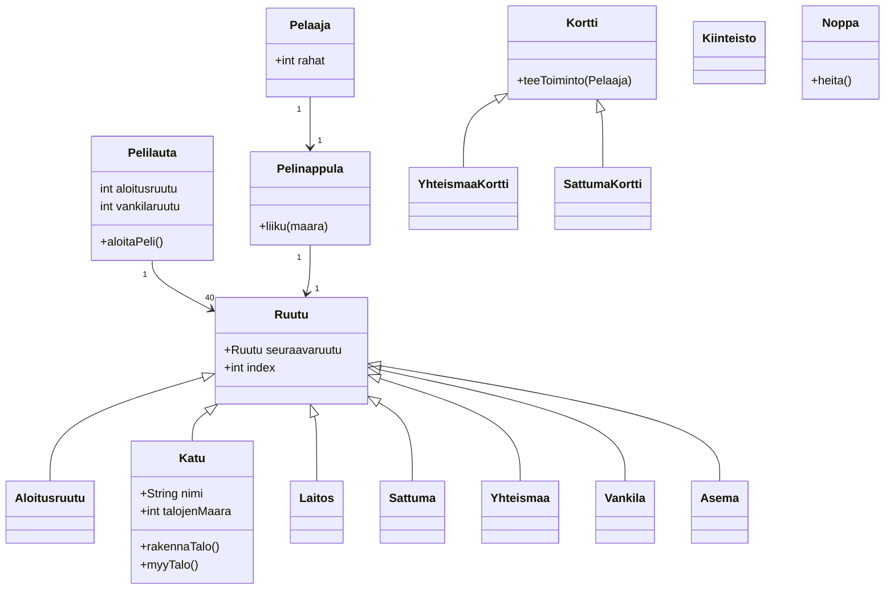

```mermaid

classDiagram

Pelaaja "1" --> "1" Pelinappula 
Pelilauta "1" --> "40" Ruutu
Pelinappula "1" --> "1" Ruutu
Ruutu <|-- Aloitusruutu
Ruutu <|-- Katu
Ruutu <|-- Laitos
Ruutu <|-- Sattuma
Ruutu <|-- Yhteismaa
Ruutu <|-- Vankila
Ruutu <|-- Asema
Kortti <|-- YhteismaaKortti
Kortti <|-- SattumaKortti

 class Kiinteisto


 class Noppa{
  +heita()
 }

 class Pelaaja{
  +int rahat
 
 }

 class Pelilauta{
  int aloitusruutu
  int vankilaruutu

  +aloitaPeli()
 }

 class Ruutu{
  +Ruutu seuraavaruutu
  +int index
 }

 class Pelinappula{

  +liiku(maara)
 }

 class Aloitusruutu

 class Vankila

 class Asema

 class Laitos

 class Sattuma

 class Yhteismaa

 class Kortti{
  +teeToiminto(Pelaaja)
 }

 class YhteismaaKortti

 class SattumaKortti

 class Katu{
  +String nimi
  +int talojenMaara

  +rakennaTalo()
  +myyTalo()
 }
```
